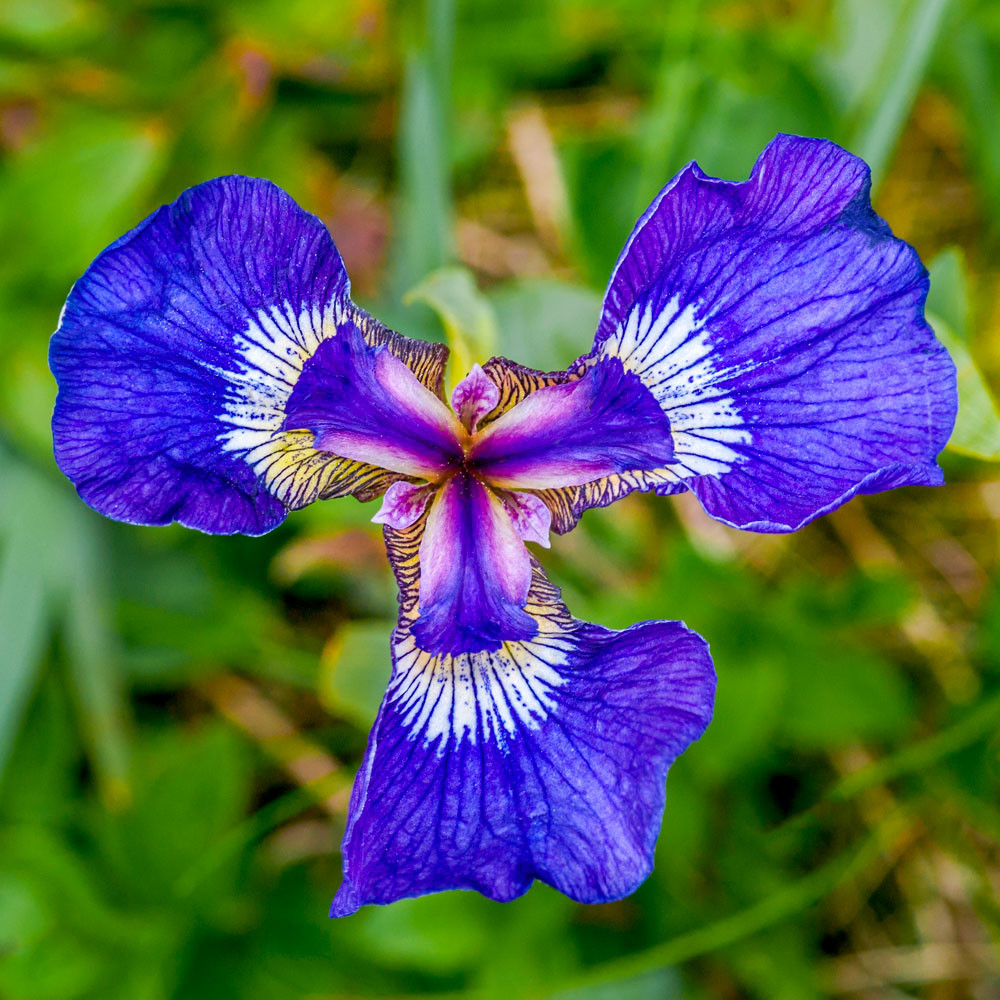
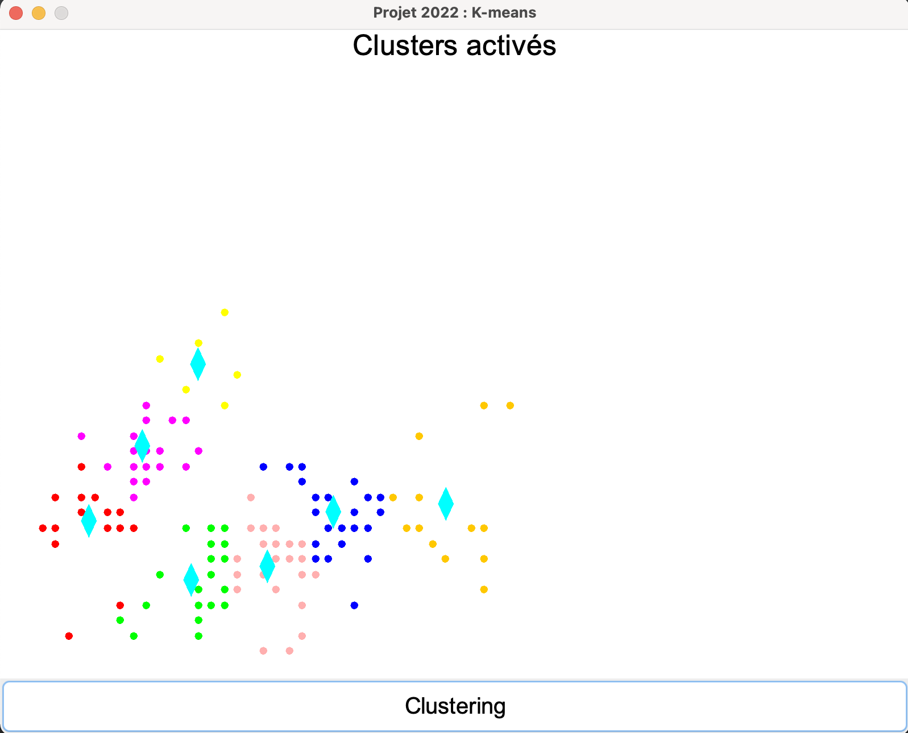
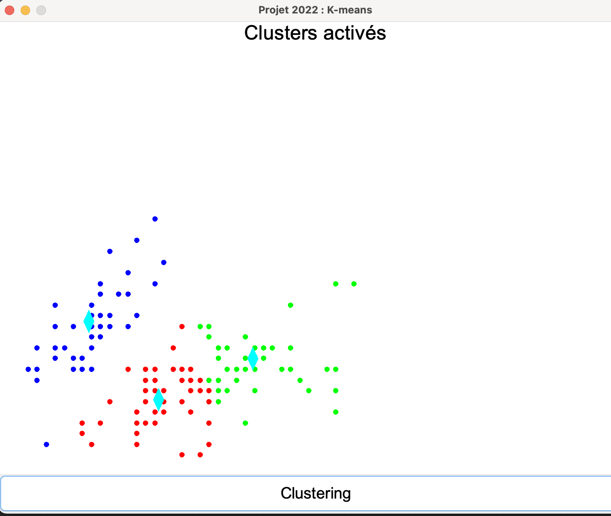
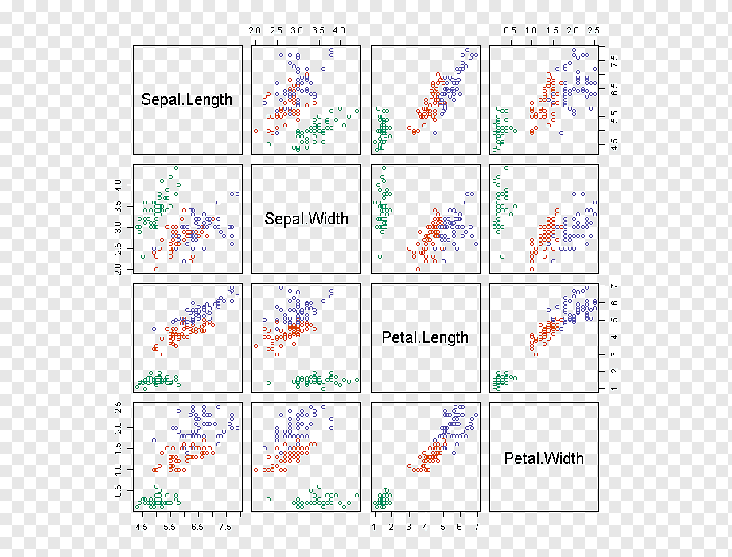

# K-means d'Iris Setosa

## Qu'est-ce que le K-means ?
Selon Wikipedia  :

>K-means est une méthode de partitionnement de données et un problème d'optimisation combinatoire. Étant donnés des points et un entier k, le problème est de diviser les points en k groupes, souvent appelés clusters, de façon à minimiser une certaine fonction.

*******
Table des matières
1. [K-means avec les 7 clusteurs](#7clusteurs)
2. [K-means avec 3 clusteurs](#3clusteurs)
3. [Differentes états de l'Iris](#etats)

*******

  

## K-means avec les 7 clusteurs

  

## K-means avec 3 clusteurs

  

* Iris Setosa - en bleu
* Versicolor - en rouge
* Virginica - en vert

### Differentes états de l'Iris

Afin de tourner et afficher les differentes états de l'iris (en détail), il suffit de modifier legerement le code : 

    KMeans.scala
    --ligne 24 et 25--
    //pour faire tourner iris il suffit de changer les val par ex tourner (2)

      pointsT.append(tourner(0).toDouble) 
      pointsT.append(tourner(1).toDouble)
      i += 1

© Réalisé par **Sebastien Rodrigues** et **Charles Batchaev**

